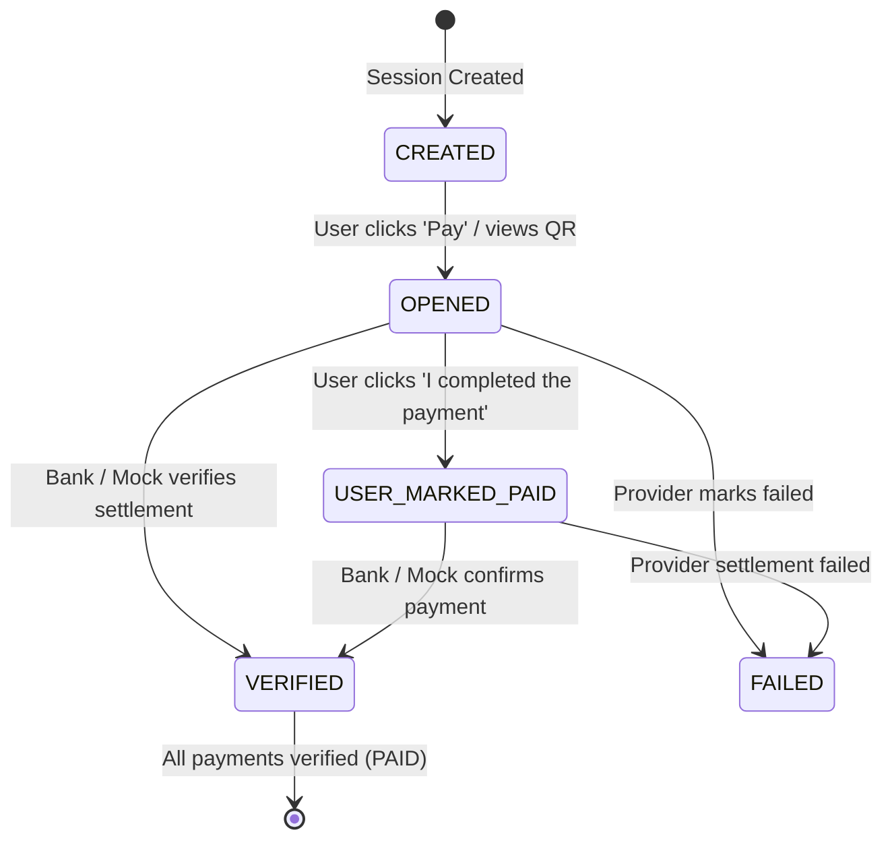

# UPI Split Pay ⚡

> **An experimental UPI payment-splitting and reconciliation prototype.**

UPI Split Pay is a prototype web application designed to explore splitting a single large UPI collection amount into smaller, automated payment chunks (default max chunk ₹1,999), generating compliant UPI payment URIs and QR codes for each chunk, tracking multi-step progress, and maintaining a verifiable backend reconciliation ledger.

---

## 🚀 Key Features

- **Scan & Extract**: Detects payee UPI Virtual Payment Address (`pa`), payee name (`pn`), merchant code (`mc`), and embedded amounts (`am`) via live camera or QR image upload.
- **Embedded Amount Handling**: If a scanned QR already contains a fixed amount, prompts the user to either use the detected amount or enter a custom sum.
- **Integer Paise Financial Engine**: Performs all financial computations and splits in integer paise (e.g. ₹10,000 = `1,000,000` paise). Avoids binary floating-point rounding errors.
- **Auto & Custom Splitting**:
  - Default chunk strategy: Max ₹1,999 (199,900 paise) per chunk.
  - Guaranteed mathematical invariant: $\sum \text{chunks} \equiv \text{total}$.
  - Custom split editor with real-time balance validation.
- **Responsive Payment Experience**:
  - **Desktop**: Large, scannable QR codes for each step with instant UPI link copy.
  - **Mobile**: Direct `upi://pay` deep link ("Pay ₹X via UPI") with fallback QR toggle.
- **State & Reconciliation Engine**:
  - Distinguishes between `USER_MARKED_PAID` and `VERIFIED`.
  - Backend recalculates verified sums and invoice status (`PENDING`, `PARTIALLY_PAID`, `PAID`) strictly from database records.
- **Demo Mode**: Includes a simulated mock banking provider (`MockPaymentProvider`) with visual indicator (`DEMO — NO REAL MONEY IS TRANSFERRED`) to test end-to-end verification and reconciliation flows.
- **Session Persistence**: Browser refreshes seamlessly restore the current payment session and progress.
- **Zero Sensitive Data**: Never requests, collects, or stores UPI PINs, OTPs, bank passwords, or debit card credentials.

---

## 🏛️ System Architecture

```
                                  ┌───────────────────────────┐
                                  │   Payee Scanned QR Code   │
                                  └─────────────┬─────────────┘
                                                │
                                                ▼
┌─────────────────────────────────────────────────────────────────────────────────────────┐
│                               FRONTEND (React + Vite + TS)                              │
│                                                                                         │
│  [ Step 1: Scan / Upload QR ] ──► [ Step 2: Enter Total ₹ ] ──► [ Step 3: Split Plan ]  │
│                                                                          │              │
│  [ Final Screen: Reconciliation ] ◄── [ Step 4 & 5: Pay / Verify ] ◄─────┘              │
│                                                │                                        │
└────────────────────────────────────────────────┼────────────────────────────────────────┘
                                                 │ REST API (/api/*)
                                                 ▼
┌─────────────────────────────────────────────────────────────────────────────────────────┐
│                                BACKEND (FastAPI + Python)                               │
│                                                                                         │
│  ┌──────────────────────┐   ┌──────────────────────┐   ┌─────────────────────────────┐  │
│  │   split_service.py   │   │    upi_service.py    │   │  reconciliation_service.py  │  │
│  │ (Integer Paise Math) │   │ (RFC UPI URI & QR)   │   │  (True Financial Ledger)    │  │
│  └──────────────────────┘   └──────────────────────┘   └─────────────────────────────┘  │
│                                                 │                                        │
│  ┌──────────────────────────────────────────────┴────────────────────────────────────┐  │
│  │                     PaymentProvider Interface / MockPaymentProvider               │  │
│  └──────────────────────────────────────────────┬────────────────────────────────────┘  │
│                                                 │                                        │
│                                ┌────────────────▼───────────────┐                       │
│                                │   SQLite / PostgreSQL Engine   │                       │
│                                └────────────────────────────────┘                       │
└─────────────────────────────────────────────────────────────────────────────────────────┘
```

---

## 💳 UPI URI Format Specification

Generated UPI payment links conform to NPCI specifications:

```
upi://pay?pa={payee_vpa}&pn={payee_name}&am={amount_in_rupees}&cu=INR&tr={transaction_ref}&tn={transaction_note}
```

### Parameter Breakdown
| Parameter | Description | Example |
|---|---|---|
| `pa` | Payee Virtual Payment Address (VPA) | `testmerchant@upi` |
| `pn` | Payee or Merchant Name (URL-encoded) | `Apex%20Electronics` |
| `am` | Transaction Amount in Rupees | `1999` or `5` |
| `cu` | Currency Code | `INR` |
| `tr` | Unique transaction reference per chunk | `TXN26091717080001UPSP` |
| `tn` | Transaction description/note | `Split%201%20of%206` |
| `mc` | Merchant Category Code (optional) | `5411` |

---

## 🧮 Financial Splitting & Invariants

All calculations are performed with **integer paise** ($1\text{ INR} = 100\text{ paise}$):

$$\text{total\_paise} = \text{round}(\text{rupees} \times 100)$$

### Example: ₹10,000 Splitting
Given Total = $1,000,000$ paise and Max Chunk = $199,900$ paise:
1. Payment 1: ₹1,999 (199,900 paise)
2. Payment 2: ₹1,999 (199,900 paise)
3. Payment 3: ₹1,999 (199,900 paise)
4. Payment 4: ₹1,999 (199,900 paise)
5. Payment 5: ₹1,999 (199,900 paise)
6. Payment 6: ₹5 (500 paise)
$$\sum_{i=1}^6 \text{Payment}_i = 1,000,000\text{ paise } (\text{₹}10,000)$$

### Non-Negotiable Invariants
1. $\sum \text{chunks} \equiv \text{total\_amount\_paise}$
2. $\forall c \in \text{chunks}: c > 0$
3. No binary floating-point representations (`float`, `round()` on currency) in core financial code.

---

## 🔄 Payment Lifecycle States



> [!NOTE]
> **Prototype Limitation Notice**: Generating a UPI URI or clicking *"I completed the payment"* does not constitute verification that money moved through the banking system. Live bank settlement requires direct webhook or payment aggregator callback integration. **Demo Mode** simulates these callbacks.

---

## 📁 Project Structure

```
.
├── backend/
│   ├── app/
│   │   ├── api/
│   │   │   └── endpoints.py         # REST endpoints
│   │   ├── models/
│   │   │   └── session.py           # SQLAlchemy database tables
│   │   ├── schemas/
│   │   │   └── session.py           # Pydantic v2 schemas
│   │   ├── services/
│   │   │   ├── split_service.py     # Integer paise financial algorithms
│   │   │   ├── upi_service.py       # UPI URI builder & QR parser
│   │   │   ├── payment_provider.py  # PaymentProvider ABC & MockProvider
│   │   │   └── reconciliation_service.py # Database ledger reconciliation
│   │   ├── config.py                # Server configuration
│   │   ├── database.py              # Database connection
│   │   └── main.py                  # FastAPI application entrypoint
│   └── tests/
│       ├── test_split_service.py    # Split & paise tests
│       ├── test_upi_service.py      # URI & QR parser tests
│       └── test_reconciliation_and_api.py # Full API lifecycle tests
├── frontend/
│   ├── src/
│   │   ├── components/
│   │   │   ├── Navbar.tsx           # Header & demo mode toggle
│   │   │   ├── QRScanner.tsx        # Camera & image QR decoder
│   │   │   ├── AmountInput.tsx      # Amount form & QR amount alert
│   │   │   ├── SplitBreakdown.tsx   # Split breakdown & custom editor
│   │   │   ├── PaymentFlow.tsx      # Desktop QR & mobile deep link
│   │   │   └── FinalScreen.tsx      # Reconciled receipts & summary
│   │   ├── hooks/
│   │   │   └── usePaymentSession.ts # Session persistence hook
│   │   ├── services/
│   │   │   └── api.ts               # Typed API client
│   │   ├── types/
│   │   │   └── index.ts             # TypeScript interfaces
│   │   ├── App.tsx                  # Main wizard & routing
│   │   └── index.css                # Tailwind CSS styling
│   ├── index.html
│   ├── package.json
│   ├── tsconfig.json
│   └── vite.config.ts
├── .env.example
├── pytest.ini
└── README.md
```

---

## ⚙️ Quickstart & Local Setup

### 1. Prerequisites
- **Python**: 3.10+
- **Node.js**: v18+ with `npm`

### 2. Backend Setup
```bash
# From project root
python -m venv .venv

# Activate virtual environment
# Windows (PowerShell):
.\.venv\Scripts\Activate.ps1
# Linux / macOS:
# source .venv/bin/activate

# Install dependencies
pip install fastapi uvicorn pydantic sqlalchemy pytest httpx

# Run tests to verify setup
pytest backend/tests -v

# Start FastAPI server on port 8000
uvicorn backend.app.main:app --host 127.0.0.1 --port 8000 --reload
```
The backend will be live at `http://127.0.0.1:8000` (Interactive Swagger Docs at `http://127.0.0.1:8000/docs`).

### 3. Frontend Setup
```bash
# In a separate terminal, navigate to /frontend
cd frontend

# Install dependencies
npm install

# Start Vite development server
npm run dev
```
The frontend application will be live at `http://localhost:5173`.

---

## 🧪 Running Automated Tests

Run the test suite across all 20+ unit and integration tests:
```bash
.\.venv\Scripts\pytest backend/tests -v
```

### Covered Test Scenarios:
- Split calculation for standard amounts (₹10,000 $\rightarrow$ 5 × ₹1,999 + ₹5)
- Edge case amounts: ₹1, ₹100, ₹1,999, ₹2,000, ₹2,001, ₹50,000, ₹1,00,000
- Integer paise arithmetic (no floating-point rounding errors)
- Strict invariant validation: $\sum \text{chunks} == \text{total}$
- Rejection of negative amounts, zero amounts, and invalid types
- Custom split validation and sum mismatch detection
- RFC-compliant UPI URI generation with URL encoding
- Scanned QR parsing: extracting payee VPA, name, amount, and reference
- Rejection of invalid non-UPI QR codes
- Full API session lifecycle, payment state transitions, and reconciliation ledger

---

## 🔒 Security Best Practices

- **Zero Banking Credentials**: Never asks for or stores UPI PINs, passwords, OTPs, or debit/credit card CVVs.
- **Untrusted QR Sanitization**: Validates parameters (`pa`, `pn`, `am`, `cu`) using strict character patterns and regex rules.
- **Injection Prevention**: URL-encodes all user and merchant metadata using RFC 3986 encoding.
- **Server Authority**: The backend recalculates all totals, split sums, remaining balances, and reconciliation states. Client-reported numbers are never trusted for financial balance.

---

## 📄 License
MIT License. Created for software architecture and payment prototyping demonstrations.
